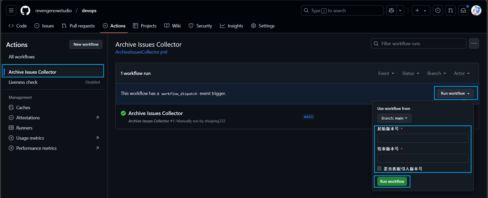
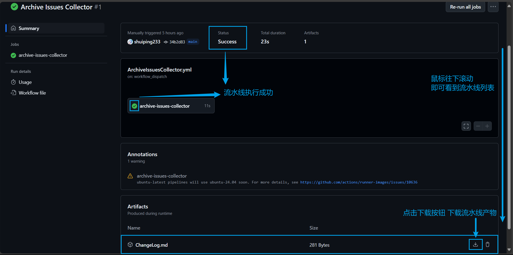

# ChangeLog输出流水线使用指南

- 此流水线会根据版本号范围来提取符合版本号范围的归档内容并输出重新格式化成友好的ChangeLog格式的markdown文件
- 使用步骤:
  - 输入版本号范围,手动运行流水线,详细变量定义参见[流水线变量定义](#流水线变量定义)
  - 
  - 流水线完成后,在对应流水线任务中下载流水线输出的产物(artifact)
  - 

> [!NOTE]
> 流水线输出产物是自动打包成zip格式的,解压后即可查看ChangeLog文件

## 流水线变量定义
- 起始版本号
  - 必填
  - 类型 : 字符串 
  - 描述 : 匹配的最小版本号,支持新版本号和旧版本号和特殊版本号,不要只输入空格
  - 示例 
    - 0.99.915b1 
    - G1024 
    - 原版YR

- 结束版本号
  - 必填
  - 类型 : 字符串 
  - 描述 : 匹配的最大版本号,支持新版本号和旧版本号和特殊版本号,不要只输入空格
  - 示例 
    - 0.99.915b1 
    - G1024 
    - 原版YR

- 是否匹配引入版本号
  - 选填
  - 类型 : 布尔值 , 选项
  - 描述 : 若勾选,则也匹配**引入版本号**符合条件的归档内容,否则默认值只匹配**归档版本号**
  - 默认值 : 否
  
  

